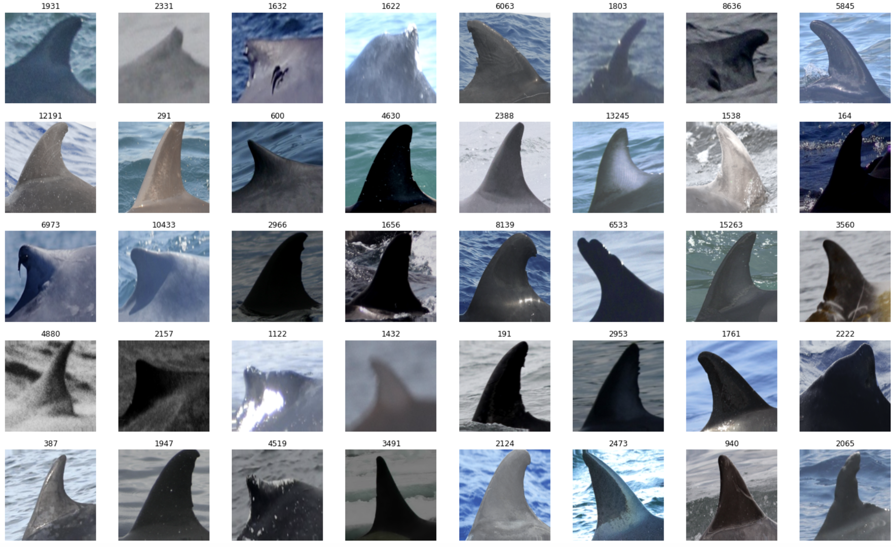

# Kaggle_Happywhale Whale and Dolphin Identification
This repository contains the code and processes for identifying individual whales and dolphins using deep learning models.

## Preparation and Process

1. **Data Loading and Preprocessing**:
   - Load whale and dolphin images from the Kaggle dataset.
   - Resize images to 512x512 pixels, standardize pixel values, and apply data augmentation techniques.
   - Encode labels using `LabelEncoder` and convert them to one-hot encoding.

2. **Feature Extraction with EfficientNet**:
   - Utilize "EfficientNet" as a feature extractor with pre-trained weights.
   - Remove the top layers and add custom layers for classification.

3. **Training the Model**:
   - Train the model on TPU using Adam optimizer and "ArcFace" loss.
   - Evaluate the model's performance on validation data.

4. **Prediction with KNN**:
   - Extract features from test images using the trained EfficientNet model.
   - Train a "KNN model" on the training features and predict test features' categories.

5. **Evaluation and Submission**:
   - Assess model performance on validation data.
   - Generate a CSV file with test predictions for Kaggle submission.

6. **Ensemble Method**:
   - Combine predictions from multiple trained models using an "ensemble" method.
   - Perform weighted averaging of predictions to improve accuracy.

## Citation:
If you find this code is useful in your research, please consider to cite:

    @misc{happy-whale-and-dolphin,
        author = {Ted Cheeseman, Ken Southerland, Walter Reade, Addison Howard},
        title = {Happywhale - Whale and Dolphin Identification},
        publisher = {Kaggle},
        year = {2022},
        url = {https://kaggle.com/competitions/happy-whale-and-dolphin}
    }
